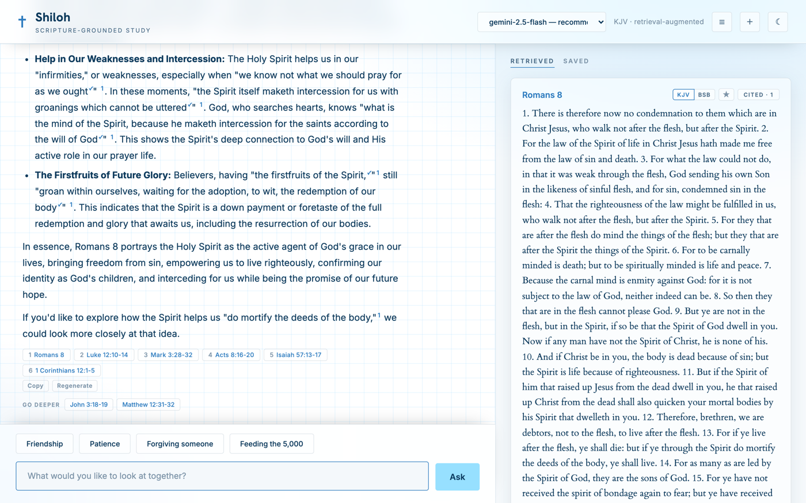
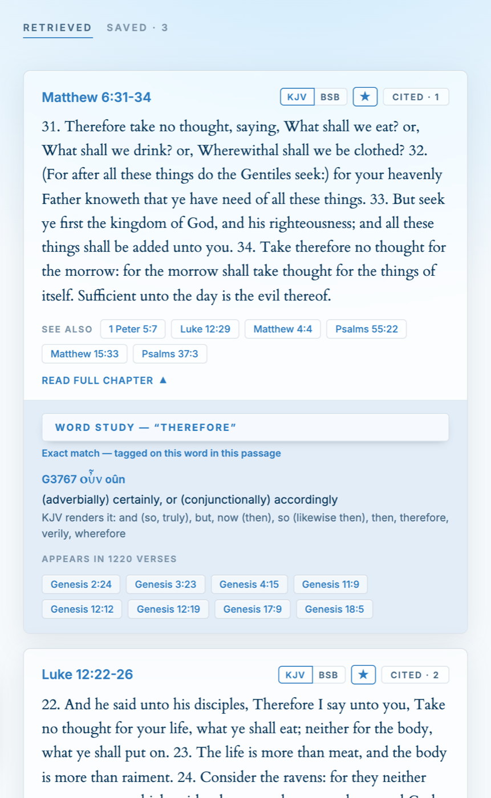
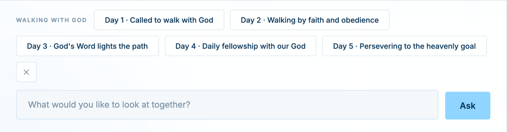
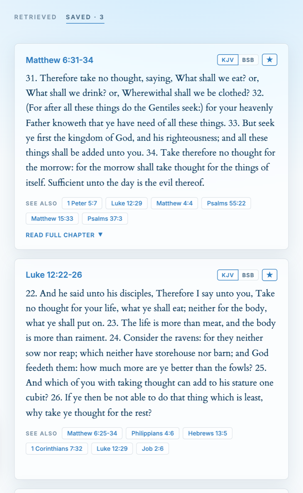

# Shiloh

An open-source Bible study assistant that reads the text before it answers you.



---

## What this is

Most AI chatbots will happily talk about the Bible from memory. They also invent
verses, misquote real ones, and give you no way to check. That's a bad tool for
studying scripture.

Shiloh works the other way around. Ask a question and it **searches the actual
text first**, pulls the passages that bear on it, and answers only from those,
showing you every verse it used, numbered to match the citations in its reply.
Then it goes back over its own answer and checks each quotation word-for-word
against the KJV. Verbatim quotes get a checkmark. Paraphrases get flagged with
the real wording. Invented ones get called out.

**It runs entirely on your machine.** The default setup uses a free local model
through [Ollama](https://ollama.com): no account, no API key, no bill, and no
question or passage leaving your computer. Plug in Gemini or Claude instead if
you want stronger answers.

**And it's built to be taken apart.** Shiloh is one small FastAPI backend and one
HTML file. Change the translation, the commentary, the assistant's voice, the
colours, the safety rules. [Make it yours](#make-it-yours) is a real section
below, not a gesture. This is a tool for studying scripture, and people study
scripture differently.

---

## Get it running

You need **Python 3.10+** and about **750 MB of free disk** for the scripture
text and search index.

```bash
git clone https://github.com/AjiboyeDara/shiloh.git
cd shiloh

python -m venv .venv && source .venv/bin/activate
pip install -r requirements.txt
cp .env.example .env

# Free local model. Install Ollama from https://ollama.com first
ollama pull llama3.2
ollama serve &

python scripts/setup.py       # downloads scripture, builds the search index
uvicorn app.main:app --reload
```

Open **http://localhost:8000** and click **Enter Shiloh** (or go straight to
`/app`).

A few honest notes on that setup step: it downloads ~13 MB of scripture, then
embeds about 21,000 passages on your CPU, which takes **10-20 minutes** on a
typical laptop. It's safe to re-run: finished steps are skipped. The first
question you ask takes a few extra seconds while the search model loads.

**Want better answers?** Small local models are the weak link: they drop
citations and paraphrase where they should quote. A free
[Gemini API key](https://aistudio.google.com/) in your `.env` makes a large
difference, and you can switch models per question from the picker in the header.

### With Docker instead

```bash
cp .env.example .env      # set LLM_PROVIDER and the matching API key
docker compose up --build
```

The image builds the search index at build time, so the first start is slow but
every start after that is instant. If you leave `LLM_PROVIDER=ollama`, Ollama
needs to be running on your host machine, and the compose file already points
the container at it.

---

## Using it

**Ask anything about scripture.** A passage, a theme, a character, a question
you've been sitting with. Every answer is built from verses Shiloh actually
retrieved, and those verses sit beside the reply, numbered to match its `[n]`
citations. Hover a citation to light up the passage it came from.

**Every quote is checked.** After the model writes its answer, Shiloh compares
each quoted span against the KJV word-for-word. You'll see a ✓ on quotes that
match, and a warning with the real wording on quotes that don't.

**Click any word for the original language.** Tap a word in a passage to see the
Hebrew or Greek behind it: the lemma, transliteration, definition, how the KJV
renders it elsewhere, and a concordance of everywhere it appears.



**Follow the thread.** Each passage carries "See also" cross-references you can
open inline, and each answer ends with a couple of *Go deeper* chips that connect
what you just read to a related passage.

**Reading plans.** Give Shiloh a theme and a number of days and it builds a plan,
each day a subtopic with real passages attached. Tap a day to study it; it
marks itself done.



**Save verses you want to keep.** Star any passage and it lands in the Saved tab,
where it stays independent of any conversation.



**Your study stays yours.** Conversations are saved in your browser, with search,
rename, and Markdown export. There's also a JSON backup of everything
(conversations, saved verses, and your reading plan) that imports back by merging,
so you never overwrite what's already there.

Light and dark themes, and it works on a phone.

---

## Make it yours

Shiloh has no build step. No bundler, no `package.json`, no compile. The frontend
is one HTML file. Edit it and refresh. Here's where to change things.

### The assistant's voice

`app/rag.py`, the `SYSTEM_PROMPT` near the top. It's split into four labelled
blocks so you can edit one without disturbing the others:

- **Voice.** Tone, warmth, how it opens and closes. Change this first.
- **Rigor.** Citation rules and the instruction to quote exactly. It also holds
  the line about flagging doctrinally contested questions rather than picking a
  side. **If you're building this for a particular tradition, that's the line to
  edit.**
- **Citation example.** A worked `[1]`/`[2]` example. Keep it. Small models drop
  citations entirely without it.
- **Scope and safety.** What Shiloh will and won't discuss.

`REFUSAL_MESSAGE` and `CRISIS_MESSAGE` are just below. **`CRISIS_MESSAGE`
contains a US crisis line (988). If you're outside the US, change that first.**

### A different translation

`scripts/download_bible.py`. Point `RAW_URL` at a JSON source for the translation
you want and adjust `normalize()` if its shape differs. Everything downstream
only needs a flat list of `{book, chapter, verse, text}`. The `BOOK_NAMES` list
must match your source's book order.

> Use a public-domain translation. ASV, WEB, Douay-Rheims, and others are fine.
> Don't ship a copyrighted modern translation (NIV, ESV, NLT) without a licence
> from its publisher.

### Your own commentary

Drop JSON files into `resources/commentary/` named after the book:

| Path | Format |
|---|---|
| `resources/commentary/<Book>.json` | `{"1": "notes on chapter 1", "2": "...", ...}` |

That's the whole integration. No registration step: when a retrieved passage's
chapter has notes, they go into the model's context automatically. Matthew
Henry's commentary ships by default; swap it for your own tradition's.

### Another AI provider

Each provider is two functions in `app/rag.py`: a blocking `_generate_X` and a
streaming `_stream_X`. Add yours, wire it into the two dispatch chains in the
same file, add its API key to `_check_provider_key` in `app/main.py`, and list it
in `list_models()` so it shows up in the picker. Four files, and the existing
Ollama, Gemini, and Anthropic implementations are each about fifteen lines to
copy from.

### How it searches

- **The synonym map** in `app/retrieval.py` bridges modern words to the KJV's own
  vocabulary: "anxiety" to "take no thought", "Holy Spirit" to "Holy Ghost".
  It's a plain dict, and extending it is the single most effective retrieval
  improvement measured so far.
- **`EMBED_MODEL`** swaps the embedding model. Changing it means re-running
  `python scripts/setup.py`, since the index and your queries have to use the
  same model.
- **`RERANK_MODEL`** adds an optional reranking pass.
- **Chunking.** `CHUNK_SIZE` and `CHUNK_STRIDE` in `scripts/build_index.py`.

Measure before and after with `python scripts/eval_retrieval.py`. See
[docs/RETRIEVAL.md](docs/RETRIEVAL.md) for the current baseline and a log of what
has already been tried and lost. Worth reading before you spend a weekend on an
idea that's already been measured.

### The safety filter

`app/rag.py` has a small pattern-based gate that catches genuinely harmful
requests and messages that sound like someone in crisis, before they reach the
model. It's a net for weak local models, not the main guardrail, and it's
deliberately loose. The comments above it list every term left out on purpose
and the real study question each one was falsely refusing ("how do I kill my
sinful nature" is Romans 8, not violence). Read those before tightening it.

### The look

All the colours are CSS custom properties at the top of `frontend/index.html`,
one block for light and one for dark. Change `--accent`, `--bg`, and `--ink` and
you've rebranded most of the app. Known gap: `frontend/landing.html` doesn't use
the variables yet and needs editing by hand.

### The content

Hardcoded lists in `frontend/index.html` you'll probably want to make your own:
the starter prompt suggestions (`PROMPT_POOL`), the verse of the day rotation
(`VOTD_REFS`), and the words that cycle while Shiloh is thinking
(`THINKING_WORDS`).

---

## Hosting it for other people

Four optional environment variables harden a public instance. Defaults keep local
development frictionless.

| Variable | What it does |
|---|---|
| `APP_PASSWORD` | Puts HTTP Basic auth in front of everything but `/health`. The simplest way to share an instance without sharing your API bill. **Serve over HTTPS**, since Basic auth is plaintext otherwise. |
| `CHAT_RATE_LIMIT` | Per-IP requests per minute on the chat, search, and plan endpoints. `10` is sane for a public instance; `0` (default) disables it. |
| `TOOL_RATE_LIMIT` | Same, for word study. Defaults to 6× `CHAT_RATE_LIMIT`, since clicking words is how the panel is used. |
| `CORS_ORIGINS` | Allowed browser origins. Defaults to `*`; set it to your domain. |

Behind a reverse proxy, also set `TRUST_PROXY=1` so rate limits key on
`X-Forwarded-For` rather than the proxy's own address.

Every other setting is documented in [`.env.example`](.env.example).

---

## How it works

```
question ──▶ search the KJV text ──▶ the passages that matter
                                            │
                                            ▼
                       passages + question ──▶ AI ──▶ answer ──▶ quotes checked
```

**Search is hybrid.** Verses are grouped into overlapping five-verse windows and
indexed two ways: semantically, with a local embedding model
(`all-MiniLM-L6-v2`, CPU, no API key), and lexically with BM25 so exact KJV
phrasing still matches. The two result sets are fused with reciprocal-rank
fusion.

Because modern questions and 1611 English don't share vocabulary, the Berean
Standard Bible is indexed alongside as a **search-only mirror**. Shiloh searches
both and always shows you the KJV. A hand-written synonym map closes the
remaining common gaps, and scripture references you write directly ("Romans 8",
"John 3:16") are parsed out and always included.

**No scripture leaves your machine during search.** Embedding and ranking are
entirely local. Only the retrieved passages and your question go to the AI model,
and with Ollama even that stays on your computer.

**Answers are checked, not trusted.** `app/verify.py` compares every quoted span
against the KJV word-for-word after generation.

Retrieval quality is measured, not guessed. See
[docs/RETRIEVAL.md](docs/RETRIEVAL.md).

One thing worth knowing: the web pages load fonts from Google Fonts, which is the
only third-party request the frontend makes. Self-host them from `frontend/` if
you want it fully offline.

---

## Project structure

```
app/
  main.py         FastAPI routes
  rag.py          Prompting, the AI calls, the safety gate
  retrieval.py    Hybrid search, reference parsing, resource lookups
  verify.py       Word-for-word quote checking against the KJV
  word_study.py   Strong's lookups and concordance
  models.py       Request/response schemas
scripts/
  setup.py                One command; runs everything below
  download_bible.py       Fetches and normalizes the KJV and BSB
  build_index.py          Chunks, embeds, and indexes both
  fetch_*.py              Cross-references, Strong's, commentary
  eval_retrieval.py       Golden-set search eval
  eval_answers.py         End-to-end answer eval
  golden_set.json         66 questions with the passages a good tool should find
frontend/
  index.html      The whole chat UI, no build step
  landing.html    Landing page
resources/        Cross-references, Strong's, commentary (see NOTICE)
tests/            pytest suite
docs/             Retrieval baselines and screenshots
```

API endpoints: `/api/chat`, `/api/chat/stream`, `/api/search`, `/api/plan`,
`/api/chapter`, `/api/passage-text`, `/api/word-study`, `/api/models`.
Interactive docs at `/docs` when the server is running.

---

## Contributing

Bug reports, translations, commentary sources, and provider integrations are all
welcome. See [CONTRIBUTING.md](CONTRIBUTING.md) for how to run the tests and the
evals.

```bash
python -m pytest
```

## License

Shiloh's code is MIT. See [LICENSE](LICENSE).

The scripture text and study resources are not. The KJV and the Berean Standard
Bible are public domain; the cross-references are CC BY; the Strong's
dictionaries are **CC BY-SA**, which carries obligations if you redistribute
them. Every source, with its licence, is listed in [NOTICE](NOTICE). Read it
before you fork.
